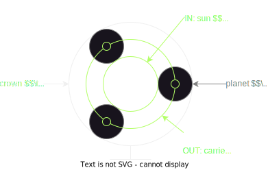
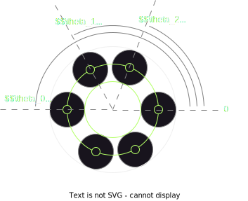
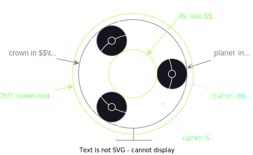
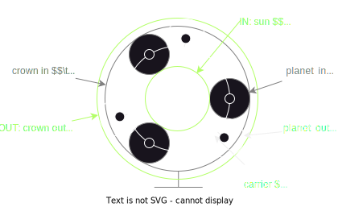

# compound planetary gearbox

[toc]

## simple planetary

Very mainstream gearbox concept, used everywhere in mechanics

- easy design because contains few parts
- easy to dimension because has easy assembly conditions
- the range of possible ratios is limited to $[{1 \over 6}, {1 \over 2}] \cap \Q$
- high torque compacity

### reduction ratio

Adherence on gears primitive circles gives:
$$
r_s (\omega_s - \omega_c) = -r_p (\omega_p - \omega_c) \\
r_e (\omega_e - \omega_c) = r_p (\omega_p - \omega_c) \\
$$
Ground gives:
$$
\omega_e = 0
$$
Simple combinations gives
$$
\omega_c (r_e - r_p) = -r_p \omega_p  \\
r_p \omega_p = r_p \omega_c + r_s (\omega_c - \omega_s)  \\
\Rightarrow~~ \omega_c(r_e - r_p + r_p + r_s) = r_s \omega_s \\

\Rightarrow~~ \omega_c = {r_s \over {r_e + r_s}} \omega_s
$$

### assembly condition

The teeth numbers discretize the set of possible ratios
$$
\omega_c = {z_s \over {z_e + z_s}} \omega_s \\
$$
The good news is that above principle can be mounted for any couple $(z_s, z_e)$ of integers. However with 1 planet but is not functional
To make it functional we need

- a central symmetry of planets to avoid vibrations due to the planet's inertia
- more than 3 planets to keep the sun centered on the crown

Let say we have $n_p$ planets equally spaced. The number of planets is constrained by the previous teeth numbers. To determine it, lets place planet $i$ on the carrier at angular position $\theta_i$

Adding a planet at position $(\theta_c, \theta_s) = (0,0)$ then rotating the mechanism to place the planet at period $i$ means
$$
{2 \pi \over n_p} = \theta_i = \theta_c = {z_s \over z_e + z_s} \theta_s
$$
Once rotated we need the sun teeth to be phased to be still ready to accept a planet at the first period, so
$$
\exist k \in \N / ~~~ \theta_s = k {2 \pi \over z_s}
$$
Hence we must ensure there is a $k \in \N$ such as
$$
{2 \pi \over n_p} = {z_s \over z_e + z_s} k {2 \pi \over z_s}  
~~\Rightarrow~~ {1 \over n_p} = {k \over z_e + z_s} \\
~~\Rightarrow~~ n_p = {z_e + z_s \over k} = 2{z_s + z_p \over k}
$$

We can see that there always exist at least $k = 2$ satisfying this condition

To strengthen the mechanism we need to put as much planets as possible, and maybe the number of planets allowed by above equally spaced placements is much smaller than what we can fit in the perimeter.

We can then use unequally spaced planets in a period. The period is determined by the biggest value of $k$ in the previous relation. then in the period we place as many planet $i$ for any value of $k_i$
$$
\theta_i = {2 \pi \over {z_e + z_s}} k_i
$$
In the following example, $\theta_0$ is the period for 2 planets, but more planets are put at $\theta_1$ and $\theta_2$ at each period

## compound planetary

The main downside of simple planetary is that the reduction ratio is limited by the size of the sun (which cannot get too small), and can hardly go below 1/6. To increase the ratio, we can compose it with a second stage in order to have a ratio proportionate to the relative difference of stages planets radius.

- not that easy to design and manufacture because of teeth phasing
- not easy to dimension without a combinator or mixed integers solver
- huge range of ratios $ [0, 1] \cap \Q $
- high torque *compacity*
- often difficult to get the exact desired ratio, but quite easy to obtain an approximate

### reduction ratio

The first stage is unchanged
$$
\omega_c = {r_s \over r_s + r_{e1}} \omega_s
$$
The second stage is adding a factor
$$
\omega_{e2} r_{e2} = V_{2e} 
= \omega_p r_{p2} + V_c = -{V_c \over r_{p1}} r_{p2} + V_c 
= {r_{p1} - r_{p2} \over r_{p1}} V_c = {r_{p1} - r_{p2} \over r_{p1}} r_c \omega_c  \\
\Rightarrow~~ \omega_{e2} = {r_c \over r_{e2}} {r_{p1} - r_{p2} \over r_{p1}} \omega_c \\
\Rightarrow~~ \omega_{e2} = {r_s + r_{p1} \over r_{e2}} {r_{p1} - r_{p2} \over r_{p1}} {r_s \over r_s + r_{e1}} \omega_s
$$

### assembly conditions

The last relation doesn't state the assumption that the two stages carrier radius must match. This puts a hard constraint on the teeth number

Lets call $s_1, s_2$ the teeth step for stages 1 and 2
$$
(z_{e2} - z_{p2}) {s_2 \over 2 \pi} = r_{e2} - r_{p2} = r_c = r_s + r_{p1} = (z_s + z_{p1}) {s_1 \over 2 \pi} \\
\Rightarrow~~ {z_{e2} - z_{p2} \over z_s + z_{p1}} = {s_1 \over s_2}
$$
Keeping this assembly constraint, we can now express the reduction ratio in term if teeth numbers
$$
\begin{align}
\omega_{e2} 
	&= {r_s + r_{p1} \over r_{e2}} {r_{p1} - r_{p2} \over r_{p1}} {r_s \over r_s + r_{e1}} \omega_s \\
	&= {s_1 (z_s + z_{p1}) \over s_2 z_{e2}} {s_1 z_{p1} - s_2 z_{p2} \over s_1 z_{p1}} {z_s \over z_s + 2 z_{p1} + z_s} \omega_s \\
	&= {s_1 \over s_2} {(z_s + z_{p1}) \over z_{e2}} {z_s \over 2 (z_s + z_{p1})} (1 - {s_2 z_{p2} \over s_1 z_{p1}})  \omega_s \\
	&= {z_s \over 2 z_{e2}} ({s_1 \over s_2} - {z_{p2} \over z_{p1}})  \omega_s \\
\omega_{e2}	
	&= {z_s \over 2 z_{e2}} ({z_{e2} - z_{p2} \over z_s + z_{p1}} - {z_{p2} \over z_{p1}})  \omega_s
\end{align}
$$
teeth number bounds
$$
z_{p1}, z_{p2}, z_s \ge z_{min} \\
z_{e2} \ge 2 z_{p2} \\
$$
This concept also has the same assembly conditions regarding planets as simple planetary

In addition to these constraints, each planet needs to be a different model because each has its own phasing between the teeth of both stages

## shifted planetary

- not that easy to design because has a lot of parts
- very easy to dimension because the stages are almost independent
- huge continuous range of reduction ratios $ [0, 1] \cap \R $
- low torque compacity because the number of planets allowed is smaller and the efforts on the planet are lacking of symmetry
- reduction ratio is physically never exact because depends on gears axis placements and not only teeth numbers

